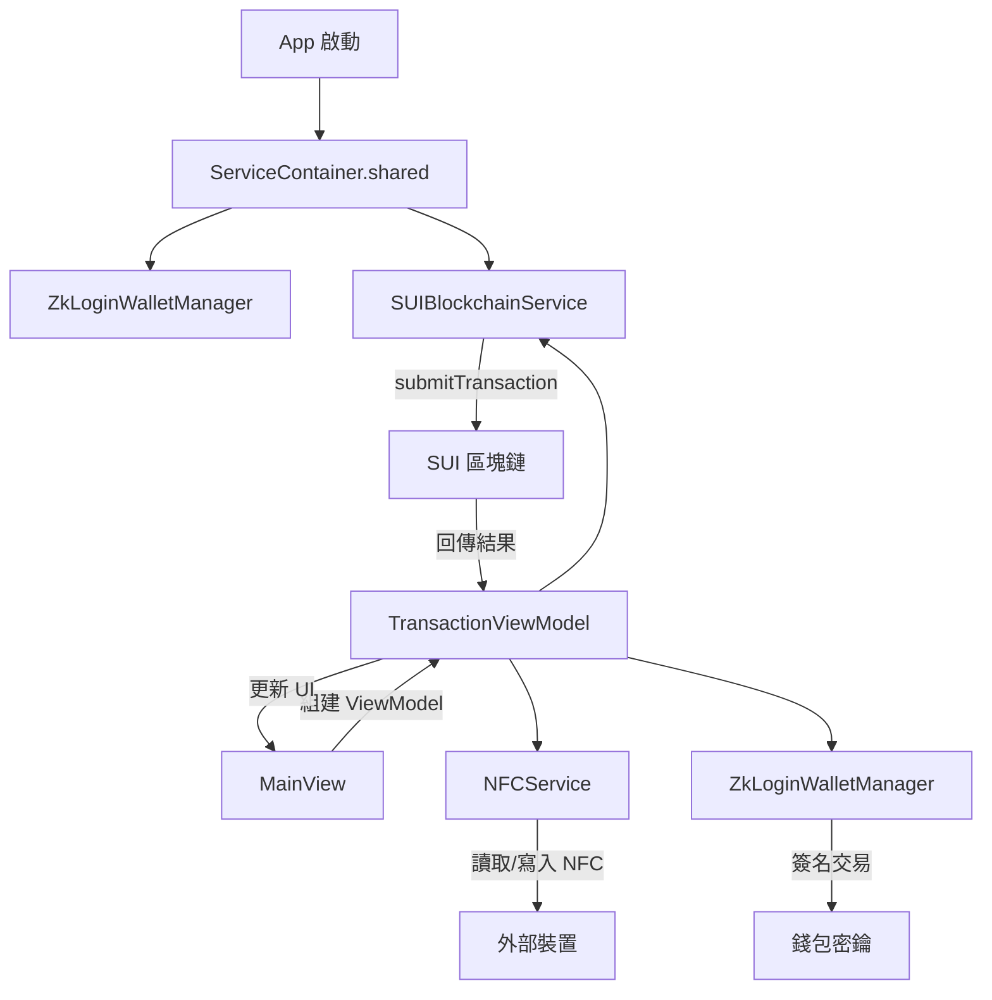
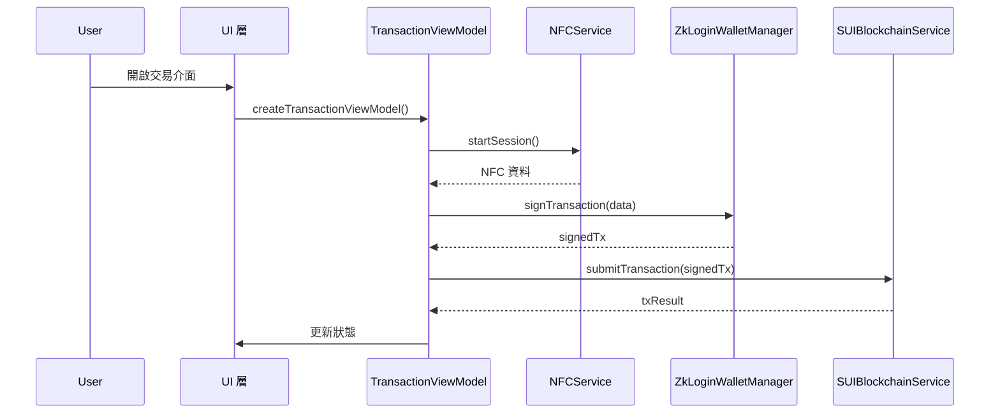
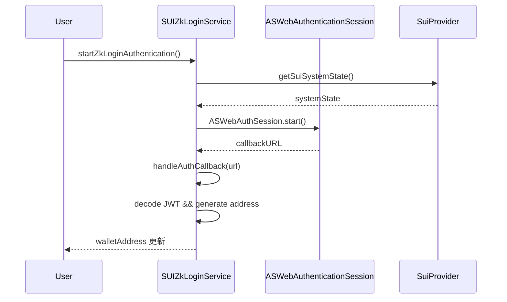

# 技術文件 (Technical Documentation)

這份文件針對開發人員，說明整個 App 的架構、流程，以及各關鍵功能的實作細節。

---

## 1. 目錄

1. [檔案結構](#1-檔案結構)
2. [整體流程圖](#2-整體流程圖)
3. [關鍵功能實作詳解](#3-關鍵功能實作詳解)
   - 3.1 依賴注入 (ServiceContainer)
   - 3.2 錢包管理 (ZkLoginWalletManager)
   - 3.3 區塊鏈互動 (SUIBlockchainService)
   - 3.4 NFC 讀寫 (NFCService)
   - 3.5 交易流程示意
   - 3.6 Keychain 助手 (KeychainHelper)
   - 3.7 zkLogin 完整認證服務 (SUIZkLoginService)
4. [設定與執行](#4-設定與執行)
5. [測試](#5-測試)

---

## 1. 檔案結構
```
pay_nfc/
├── Services/
│   ├── ServiceContainer.swift      # 依賴注入的中心
│   ├── ZkLoginWalletManager.swift  # 錢包管理
│   ├── SUIBlockchainService.swift  # 區塊鏈呼叫
│   └── NFCService.swift            # NFC 讀寫
├── ViewModels/
│   └── TransactionViewModel.swift  # 交易邏輯
├── Views/
│   └── ...                         # UI 層
└── ...
```


## 2. 整體流程圖
以下使用 Mermaid 描述 App 啟動到交易發起的核心流程：



---

## 3. 關鍵功能實作詳解

### 3.1 依賴注入 (ServiceContainer)
```swift
class ServiceContainer {
    static let shared = ServiceContainer()

    let zkLoginWalletManager: ZkLoginWalletManager
    let blockchainService: SUIBlockchainService

    private init() {
        self.zkLoginWalletManager = ZkLoginWalletManager()
        self.blockchainService = SUIBlockchainService(
            zkLoginWalletManager: zkLoginWalletManager
        )
    }
}
```
- 負責全域實例管理，確保各服務單例。
- 在 `createTransactionViewModel()` 中注入必要的服務。

### 3.2 錢包管理 (ZkLoginWalletManager)
- 負責建立/恢復用戶錢包、密鑰管理。
- 核心方法：
  - `func createWallet()`
  - `func signTransaction(_ txData: Data) -> SignedTx`

### 3.3 區塊鏈互動 (SUIBlockchainService)
- 封裝 SUI RPC 呼叫。
- 建構時注入 `zkLoginWalletManager` 用來簽名：
  `SUIBlockchainService(zkLoginWalletManager: ...)`
- 核心方法：
  - `func submitTransaction(_ signedTx: SignedTx) async throws -> TxResult`

### 3.4 NFC 讀寫 (NFCService)
- 使用 CoreNFC 建立讀寫 Session。
- 範例：
  ```swift
  func startSession() {
      let session = NFCNDEFReaderSession(...)
      session.begin()
  }
  ```

### 3.5 交易流程示意


### 3.6 Keychain 助手 (KeychainHelper)
```swift
// 用於在 Keychain 中存儲與檢索字串
try KeychainHelper.set("value", service: "serviceName")
let value = try KeychainHelper.get("serviceName")
try KeychainHelper.remove("serviceName")
```
- 刪除、儲存與移除通用密碼項目。
- 處理不同錯誤情境 (`noData`, `unexpectedData`, `unhandledError`).

### 3.7 zkLogin 完整認證服務 (SUIZkLoginService)
- 使用 `ASWebAuthenticationSession` 進行 OAuth 認證。
- 生成臨時密鑰對與 nonce，並存儲於 `UserDefaults`。
- 通過 SuiKit 向 SUI 網路獲取 epoch 與提交後續認證請求。
- 實作回調處理與錯誤管理，並暴露 `walletAddress`, `isAuthenticating`, `errorMessage`。



## 4. 設定與執行
1. `pod install` 安裝 CocoaPods 依賴。
2. 開啟 `pay_nfc.xcworkspace`。
3. 選擇目標裝置後執行。

---

## 5. 測試
- 單元測試：
  - `ZkLoginWalletManagerTests.swift`
  - `pay_nfcTests.swift`
- UI 測試：
  - `pay_nfcUITests.swift`

---

> **注意**：可依需求在此文件擴充設定、流程及範例程式碼。
